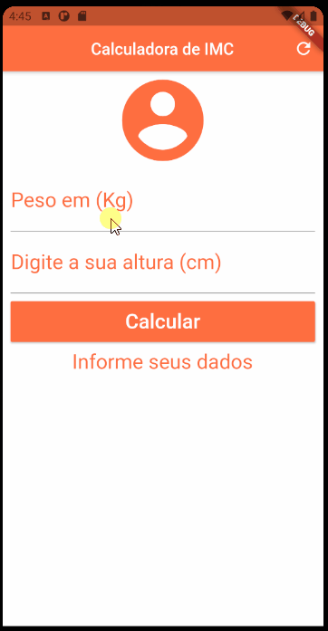

# Calculator BMI

This application calculates a person's BMI and returns the type of obesity.

    

## Used technologies
- ✔ Git.
- ✔ Dart.
- ✔ Flutter.
- ✔ Android Studio.

## Flutter:

A few resources to get you started if this is your first Flutter project:

- [Lab: Write your first Flutter app](https://flutter.dev/docs/get-started/codelab)
- [Cookbook: Useful Flutter samples](https://flutter.dev/docs/cookbook)
- [online documentation](https://flutter.dev/docs)

